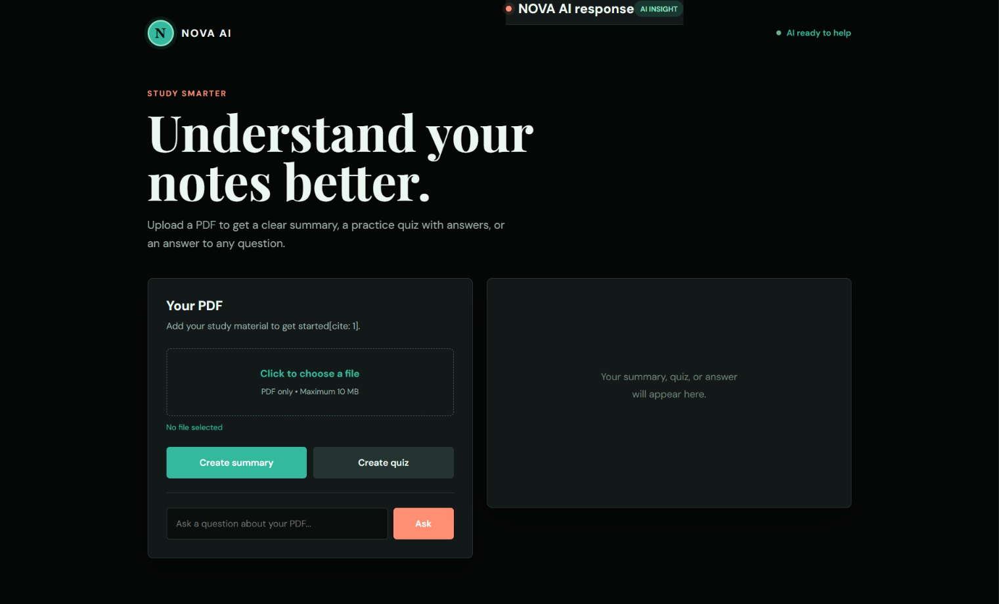

# NOVA AI | Personal Study Assistant 📚🤖

A web-based AI study assistant built with Python (Flask) that helps students instantly summarize study notes, generate practice quizzes, and answer complex questions from PDF documents.

## 🚀 Features

* **Instant Summaries:** Upload any study PDF and get a clear, structured summary in seconds.
* **Smart Quiz Generation:** Automatically creates practice quizzes with correct options and explanations.
* **Interactive Q&A:** Ask specific questions about your notes and receive precise AI-powered answers.
* **Clean UI:** A modern, distraction-free dark theme interface with Markdown support.

## 🛠️ Tech Stack

* **Backend:** Python, Flask
* **AI Integration:** Google Gemini / Groq API (PyMuPDF for text extraction)
* **Frontend:** HTML5, CSS3, JavaScript, Marked.js

## 💻 How to Run Locally

1. Clone the repository:
   ```bash
   git clone [https://github.com/jensipethani123-cmyk/NOVA-study-assistant.git](https://github.com/jensipethani123-cmyk/NOVA-study-assistant.git)

## 📸 Output Screenshot



   ---
**Author:** Jensi Pethani